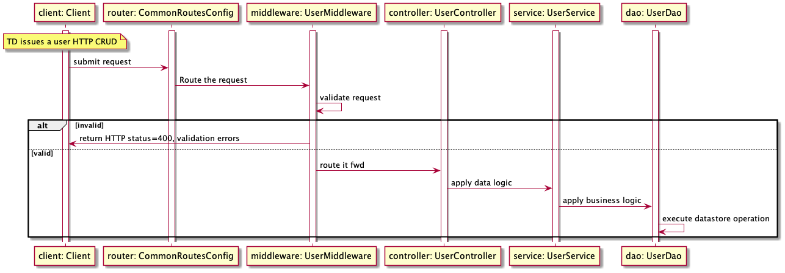
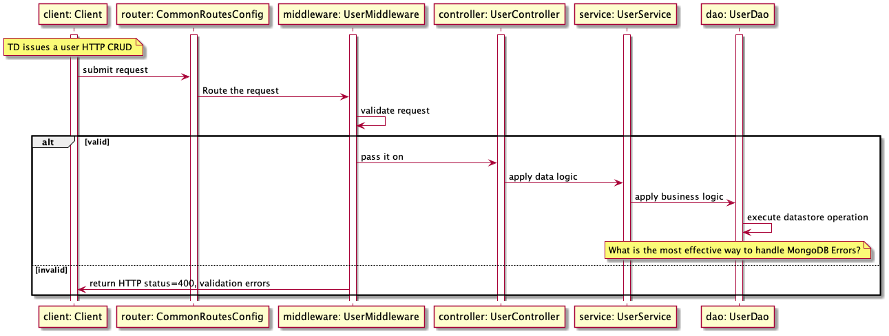
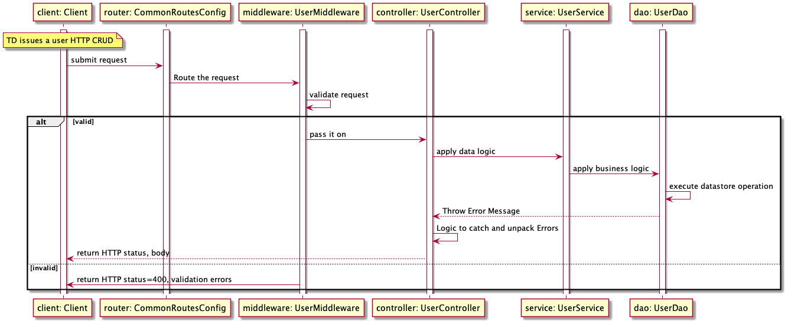
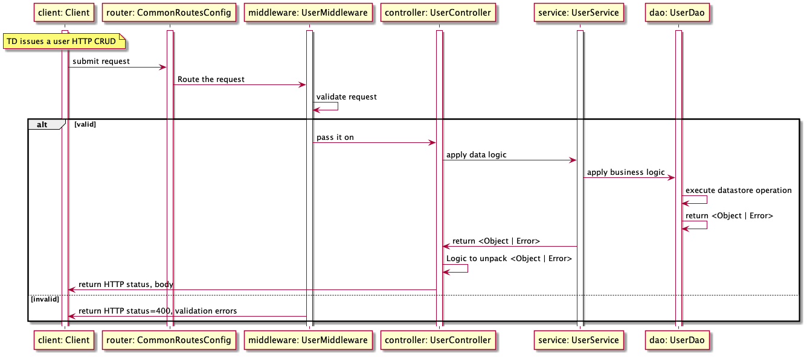
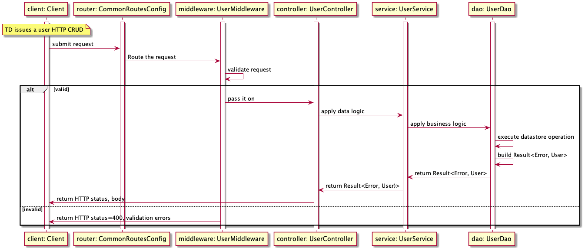

# Using Monads
I describe how I decided to use `monads` to handle datastore, `MongoDB/Mongoose` errors in order to simplify the error handling logic.

I'm writing a `Rest/HTTP` / `Node.JS` / `Typescript` application that uses `MongoDB/Mongoose` as its data store. I architected it using a routing mechanism that calls a `MIDDLEWARE` layer to validate Rest/HTTP calls, and  routes valid requests thru `CONTROLLER`/`SERVICE`/`DAO` layers. For the sake of simplification:
- The `CONTROLLER` layer applies data logic to the request, like inserting default attributes;
- The `SERVICE` layer applies business logic require prior to accessing the datastore;
- The `DAO` layer manages the datastore operation's execution.



Although the `MIDDLEWARE` layer is responsible for  validating the request's attributes, we must account for  possible `DAO` layer operations' errors.



The two standard approaches to handle possible `DAO` layer operations' errors are to :
1. Use Typescript's `try/catch` clauses for each `DAO` operation, `throw an exception` after catching an error, and add a `try/catch` clauses on each of the `CONTROLLER's` operations;
2. Use Typescript's `type` capability to return the expected `result or error` for each `DAO` operation, and logic in each and all `CONTROLLER's` operations to ascertain and act on the result type;

## Try / Catch
The `try/catch` logic can quickly become very complex. In our case, all the `CONTROLLER's` methods would have to include `try/catch` logic accounting for all possible exceptions. It is very difficult to debug cases where we do not handle  `try/catch` logic accurately.


`DAO` operation to save a user
````typescript
	addUser(user: UserDto) {
		const userMongo = UserMongo.build({...user})
		// await userMongo.save();
		userMongo.save()
			.then((user: UserDto) => {
				return user;
			})
			.catch((error: any) => {
				throw new Error(error);
			})
	}
````

`CONTROLLER` operation to save a user:
````typescript
 	async create(req: express.Request, res: express.Response) {
        let resultStatus: number;
        let resultContent: string
        userService.create(req.body)
            .then(user: UserDto => {
                resultCode = 201, 
                resultContent = JSON.stringify(user);
             })
            .catch (err => {
                // Logic to determine the error type
                // we do not kmnow where the error came from
                resultCode = 1,       // Determined by logic
                resultContent = "";     // Determined by logic     
            })
        res.status(resultStatus).send({resultContent});
    }
````

Note that in our case there are no requirements for us to apply `SERVICE` logic to the result. If so, we would have to add `try/catch` logic to the `SERVICE` layer, ensure we catch all exceptions, and throw the error again so that the `CONTROLLER` layer can catch it too; this would expose our logic to additional subtle bugs.

## Typescript Type
When using the Typescript's `type` capability in its raw form, we end up with a lot of repeated, boilerplate, logic required to ascertain the result type, again exposing our logic to subtle bugs.


`MODEL` user to model user types
````typescript
    export type UserDaoErr = {status: number, content: string};
    export type UserDaoResult = UserDto | UserDaoErr;
````

`DAO` operation to save a user
````typescript
	addUser(user: UserDto): UserDaoResult {
    const userMongo = UserMongo.build({...user})
    // await userMongo.save();
    userMongo.save()
        .then((user: UserDto) => {
            return user;
        })
        .catch((error: any) => {
            return {code: 400, content: JSON.stringify(err.errors.names)}
        })
    }
````

`CONTROLLER` operation to save a user:
````typescript
 	async create(req: express.Request, res: express.Response) {
        let resultStatus: number;
        let resultContent: string
        userDaoResult = await userService.create(req.body);
        if (typeof userDaoResult === UserDto) {
            res.status(201).send({ JSON.stringify(userDaoResult)});
        }
        if (typeof userDaoResult === UserDaoErr) {
            res.status(userDaoResult.code).send(userDaoResult.content);
        }
        res.status(.400).send("Unkown error");
    }
````
Note that in our case there are no requirements for us to apply `SERVICE` logic to the result. If so, we would have to add the same repeated, boilerplate, logic, exposing our logic to additional subtle bugs.

# Using the Result Monad
After learning about `mondads` and how they hide boilerplace logic, leaving  us solely with the functionality that we see, I decided to use it as a pattern.


I found and adopted a very simple `monad`, the [space-monad](https://www.npmjs.com/package/space-monad), that includes a [result monad](https://github.com/AlexGalays/space-monad/blob/master/src/result.ts), which is sufficient for my requirements.

Prior to using it I wrote [unit tests](https://github.com/RodrigoMattosoSilveira/node-scripts/tree/master/monad) demonstrating how to use it in my own logic.

In order to use it, I
## Modeled the `DAO` error:
````typescript
// This is the same for all `entities`, and their calls
export type DAOError = {
	code: number,
	content: string
}
````

## Modeled the `UserDao` error:
````typescript
// This is the same for `user`, and their calls
export type UserDaoResult = Result<DAOError, UserDto>
````

## Re-factored the `DAO` `create` method:
We still use the `try/catch` constructor, but instead of throwing an error, we build a `Result` monad object and return it.
````typescript
	create(user: UserDto): UserDaoResult {
    let userDaoResult: UserDaoResult | undefined;
    const userMongo = UserMongo.build({...user})
    // await userMongo.save();
    userMongo.save()
        .then((user: UserDto) => {
            userDaoResult = Ok(user);
        })
        .catch((error: any) => {
            let thisError = {
                code: 400,
                content: JSON.stringify(error.errors)
            }
            userDaoResult = Err(thisError);
        })
    // @ts-ignore
    return userDaoResult;
}
````
## Re-factored the `CONTROLLER` `create` method:
````typescript
	async create(req: express.Request, res: express.Response) {
		const result: UserDaoResult = await userService.create(req.body);
		let resultStatus: number = 0;
		let resultContent: string = '';
		result.fold(
			err => {
				resultStatus = 400,
				resultContent = err.content
			},
			result => {
				resultStatus = 201,
				resultContent = JSON.stringify(result)
			},
		)
		res.status(resultStatus).send({resultContent});
	}
````

Note that:
* The logic to handle the error is completely abstracted into the `Result` monad, leaving us use a simple `Result` monad method, `fold`. 